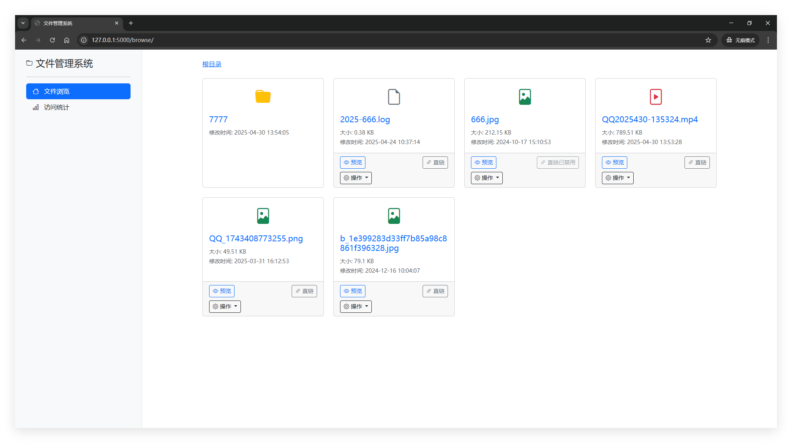
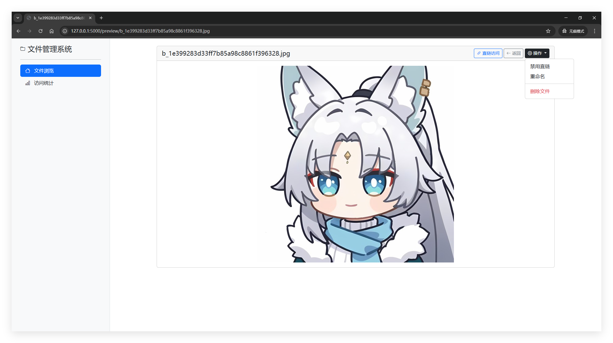
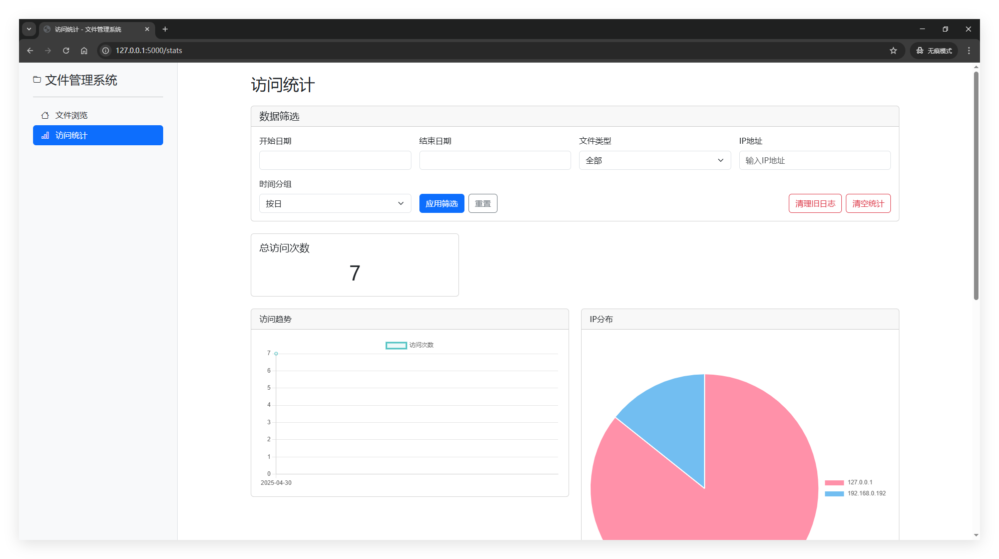
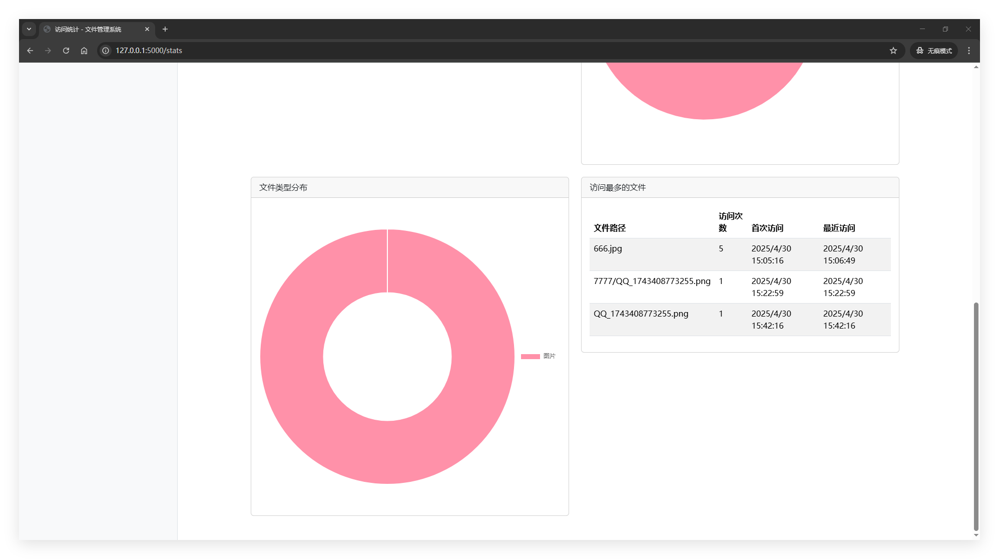

# Python Web 文件管理系统

这是一个基于Python Flask的Web文件管理系统，提供文件浏览、在线预览、直链生成和访问统计功能。

## 功能特点

- 简洁大气的卡片式布局，响应式设计适配桌面和移动端
- 支持对图片、视频、文档等多种文件类型的在线预览
- 为每个文件自动生成直链(Direct Link)
- 记录文件访问统计数据，包括访问IP、时间等信息
- 提供数据统计可视化展示，包括访问趋势、IP分布等

## 系统结构

- **后端框架**：Flask
- **数据库**：SQLite
- **前端技术**：HTML5、CSS3、Bootstrap 5、Chart.js
- **文件预览**：内置支持图片、视频、PDF和文本文件预览

## 目录结构

```
文件管理/
├── app.py              # 主应用程序
├── config.py           # 配置文件
├── data/               # 数据目录
│   └── filemanager.db  # SQLite数据库文件
├── managed_files/      # 被管理的文件目录
├── static/             # 静态资源
│   └── css/
│       └── style.css   # 自定义样式
└── templates/          # 模板文件
    ├── index.html      # 主页/文件浏览页
    ├── preview.html    # 文件预览页
    └── stats.html      # 统计数据页
```

## 安装与使用

### 环境要求

- Python 3.6+
- Flask

### 安装步骤

1. 克隆或下载项目到本地

2. 安装依赖包
   ```
   pip install flask
   ```

3. 创建必要的目录
   ```
   mkdir -p data managed_files
   ```

4. 修改配置文件 `config.py`
   - 设置 `BASE_DIR` 为你想要管理的文件目录
   - 根据需要调整其他配置项

5. 启动应用
   ```
   python app.py
   ```

6. 在浏览器中访问 `http://localhost:5000`

## 使用说明

### 文件浏览

- 主页显示配置的目录中的所有文件和子目录
- 点击文件夹可以进入该目录
- 点击文件可以进入预览页面

### 文件预览

- 系统支持以下文件类型的在线预览：
  - 图片：jpg, jpeg, png, gif
  - 视频：mp4, webm
  - 文档：pdf, txt, md
  - 其他文件类型提供下载链接

### 直链访问

- 每个文件都有一个自动生成的直链
- 直链可以在文件卡片或预览页面中找到
- 通过直链访问的记录会被保存到数据库中

### 访问统计

- 点击侧边栏的「访问统计」进入统计页面
- 统计页面显示总访问次数、访问趋势、IP分布、文件类型分布和热门文件
- 支持按时间段（日/周/月）、文件类型、IP地址等条件进行数据筛选
- 提供历史数据自动清理功能，默认保留最近3个月的访问明细
- 长期保存文件的总访问次数统计，不会被清理
- 统计数据每60秒自动刷新一次

## 自定义与扩展

### 添加新的文件类型支持

1. 在 `config.py` 的 `ALLOWED_PREVIEW_TYPES` 中添加新的文件类型
2. 在 `app.py` 的 `get_file_type` 函数中添加对应的处理逻辑
3. 在 `preview.html` 模板中添加新文件类型的预览方式

### 修改界面样式

- 编辑 `static/css/style.css` 文件自定义样式
- 或者修改 `templates` 目录下的模板文件

### 项目截图






## 注意事项

- 本系统默认运行在开发模式，生产环境部署时请关闭调试模式并使用生产级别的WSGI服务器
- 请确保被管理的文件目录具有适当的访问权限
- 对于大型文件或大量文件的场景，可能需要调整性能参数